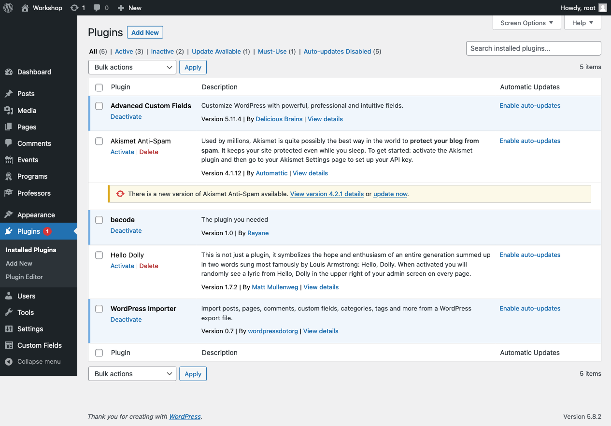
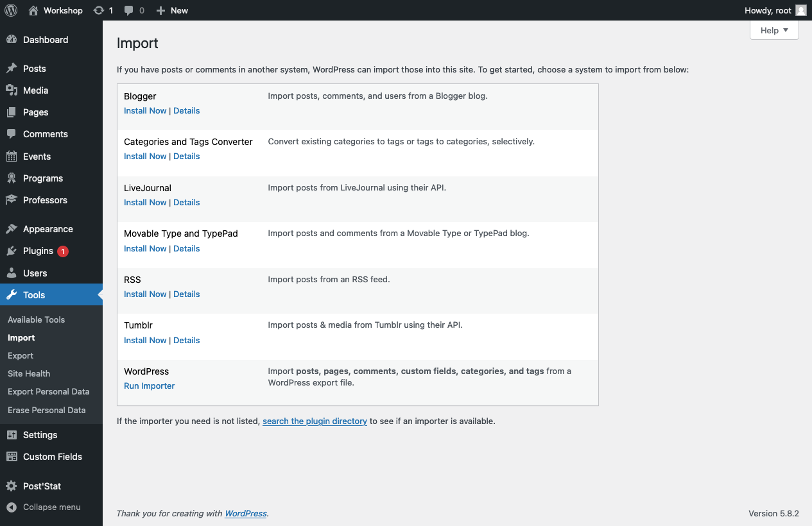
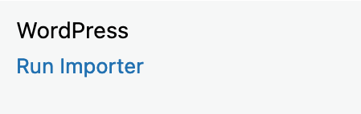
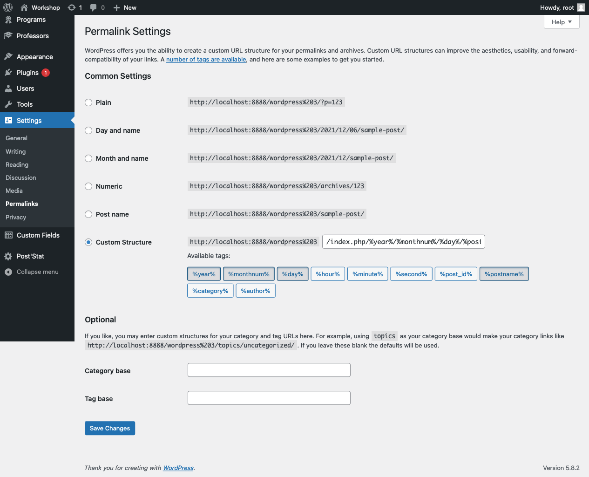

# Installation 

What do we need during the live coding?

## Initiate WordPress and Create database (unicode-ci)
[WordPress](https://github.com/RayaneLamri/pluginsWPworkshop/raw/main/content/files/wordpress.zip)
## Activate theme & plugins

## Import

- [Download this and unzip it](https://github.com/RayaneLamri/pluginsWPworkshop/raw/main/content/files/import.zip)

## Refresh permalinks

