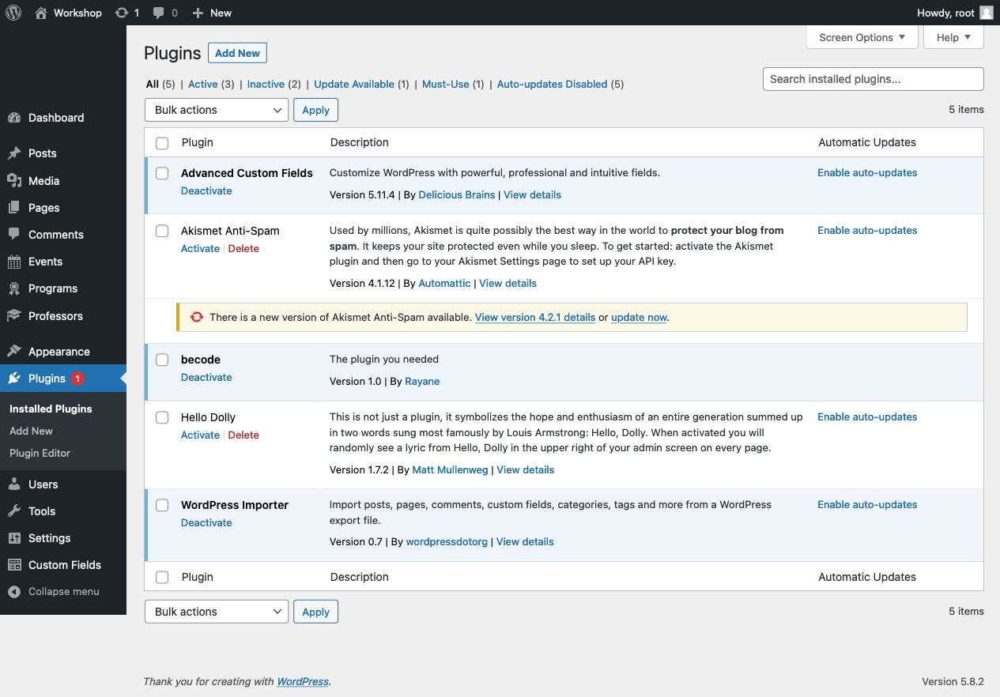

# Installation 

## Initiate WordPress and database
[WordPress](https://github.com/RayaneLamri/pluginsWPworkshop/raw/main/content/files/wordpress.zip)
## Activate theme & plugins

## Import

## Refresh permalinks

